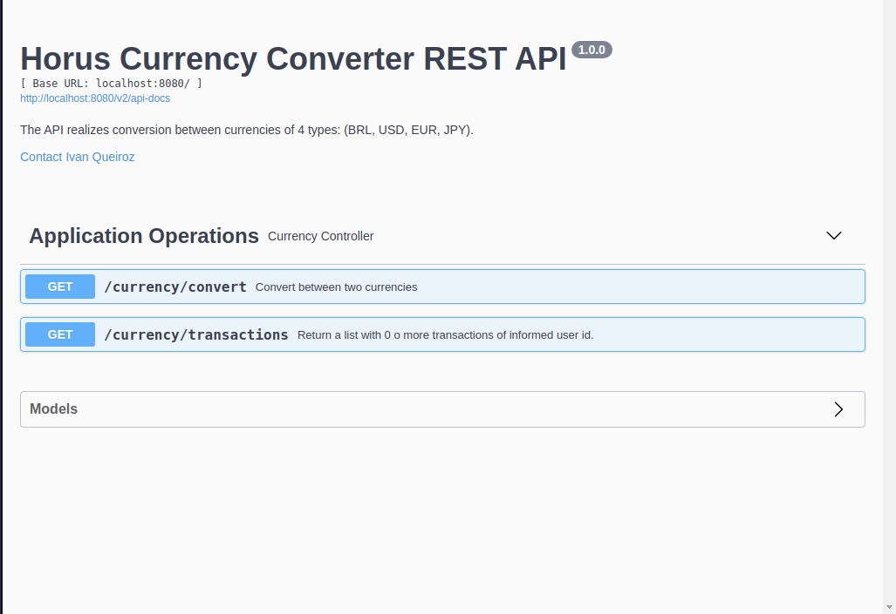
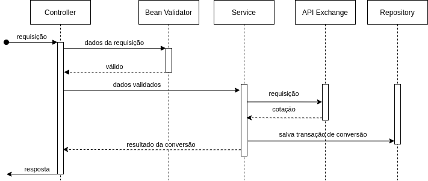
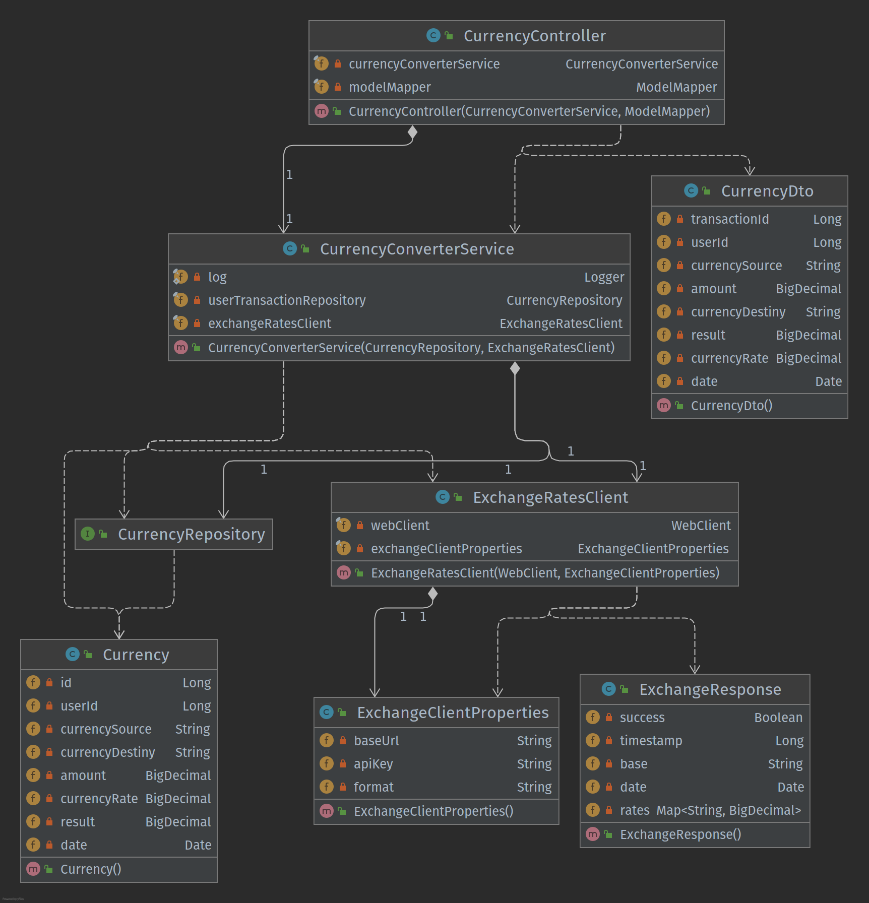

<p align="center">
  

  

  <a href="https://www.twitter.com/ivanqueiroz/">
    
  </a>

  <a href="https://github.com/ivanqueiroz/horus/commits/master">
    
  </a>

   
   <a href="https://github.com/ivanqueiroz/horus/stargazers">
    
  </a>

  <a href="https://curriculo-ivanqueiroz.herokuapp.com/">
    
  </a>

  <a href="https://ivanqueiroz.dev/">
    
  </a>

  
</p>
<h1 align="center">
    
</h1>

<h4 align="center"> 
	🚧  Horus API :moneybag:️ Concluído 🚀 🚧
</h4>

<p align="center">
 <a href="#-sobre-o-projeto">Sobre</a> •
 <a href="#%EF%B8%8F-funcionalidades">Funcionalidades</a> •
 <a href="#open_book-documenta%C3%A7%C3%A3o-da-api">Documentação da API</a> • 
 <a href="#-como-executar-o-projeto">Como executar</a> • 
 <a href="#-tecnologias">Tecnologias</a> •
 <a href="#horus#triangular_ruler-arquitetura">Arquitetura</a> •
 <a href="#-contribuidores">Contribuidores</a> • 
 <a href="#-autor">Autor</a> 
</p>


## 💻 Sobre o projeto

:moneybag: Horus — é uma API em REST que realiza a conversão entre moedas com cotações atualizadas constantemente.


Projeto desenvolvido durante desafio proposto pela Jaya Tech. O Horus pode ser consumido por sistemas financeiros que trabalham com cálculos entre moedas diferentes.

---

## ⚙️ Funcionalidades

- [x] Cálculo de conversão entre as moedas:
    - [x] Real — Código de conversão **BRL**
    - [x] Iene — Código de conversão **JPY**
    - [x] Dólar — Código de conversão **USD**
    - [x] Euro — Código de conversão **EUR**

- [x] Registros de transações realizadas por um usuário.

---

## :open_book: Documentação da API

A documentação da aplicação está disponível em Swagger:

<a href="https://horus-api-converter.herokuapp.com/swagger-ui/index.html">
  
</a>

### Swagger

<p align="center" style="display: flex; align-items: flex-start; justify-content: center;">
  
</p>

---

## 🚀 Como executar o projeto

Este projeto inicia um servidor na porta 8088, pronto para receber requisições REST.

### Pré-requisitos

Antes de começar, você vai precisar ter instalado na sua máquina as seguintes ferramentas:
[Git](https://git-scm.com), [Java 11+](https://www.oracle.com/java/technologies/downloads/#java11) e o [Maven](https://maven.apache.org/).

Além disso, é bom ter uma IDE para trabalhar com o código como [IDEA](https://www.jetbrains.com/pt-br/idea/download/) ou o [Spring Tools Suite](https://spring.io/tools).

Para testar a API é necessária uma ferramenta client REST como o [Postman](https://www.postman.com/downloads/).

#### 🎲 Rodando o Backend

```bash

# Clone este repositório
$ git clone git@github.com:ivanqueiroz/horus.git

# Acesse a pasta do projeto no terminal/cmd
$ cd horus

# Instale as dependências
$ ./mvnw clean install (Linux) ou ./mvnw.cmd clean install (Windows)

# Execute a aplicação em modo de desenvolvimento
$ ./mvnw spring-boot:run

# O servidor inciará na porta:8080 - acesse http://localhost:8080 
```

---

## 🛠 Tecnologias

As seguintes ferramentas foram usadas na construção do projeto:

#### [](https://github.com/ivanqueiroz/horus#server-springboot)**Server**

- **[Spring Boot](https://spring.io/projects/spring-boot)** — Framework escolhido por ser _stand-alone_ e requerer menor esforço para iniciar o desenvolvimento das regras de negócio.
- **[Spring Data JPA](https://spring.io/projects/spring-data-jpa)** — Escolhido para criar as operações com o banco de dados. Também reduziu o esforço para iniciar o desenvolvimento por criar as operações mais comuns (_CRUD_).
- **[Spring Boot Actuator](https://docs.spring.io/spring-boot/docs/current/reference/html/actuator.html)** — Permite a monitoração da aplicação remotamente. No Horus as permissões são: health, info, mappings, loggers, scheduledtasks e caches.
- **[Bean Validator](https://beanvalidation.org/2.0-jsr380/)** — Utilizado para validação dos valores passados para a API, permite a verificação através de anotações. Possui validações para os tipos mais conhecidos e permite a criação de validações próprias. No Horus há validação dos valores permitidos para o tipo de moeda que utiliza a especificação.
- **[Lombok](https://projectlombok.org/)** — Diminui a quantidade de código escrito utilizando anotações para gerar trechos comuns durante a compilação. Utilizado no Horus para objetos do tipo _Data Transfer_ e para gerar a configuração de _log_ na classe.
- **[modelmapper](http://modelmapper.org/)** — Mapeador de valores de objetos. No projeto é utilizado na transferência de dados entre a camada mais externa para a interna da aplicação.
- **[MockWebServer](https://github.com/square/okhttp/tree/master/mockwebserver)** — Um servidor web de teste programável. Utilizado nos testes de integração com a API externa do Exchange Rates.
- **[H2 Database](https://www.h2database.com/html/main.html)** — Banco de dados em memória (embedded). Para o propósito do projeto encaixou-se bem e é o banco principal que registra as transações de conversão. 
- **[SpringFox (Swagger)](https://springfox.github.io/springfox/)** — Plugin para o Spring Boot que gera a documentação da API do Horus.
- **[Sonarlint](https://www.sonarlint.org/)** — Todo o código criado foi analisado pelo [Sonarlint](https://www.sonarlint.org/) (plugin da IDE) a cada commit, buscando seguir as melhores práticas de legibilidade e desempenho.
- **[Jackson](https://github.com/FasterXML/jackson)** — Realiza a serialização e deserialização dos dados no formato JSON.

> Veja o arquivo [pom.xml](https://github.com/ivanqueiroz/horus/blob/master/pom.xml)

#### [](https://github.com/ivanqueiroz/horus#utilit%C3%A1rios)**Utilitários**

-   Projeto no Heroku:  **[Heroku](https://www.heroku.com/)**  →  **[Horus](https://horus-api-converter.herokuapp.com/)**

---

## 	:triangular_ruler: Arquitetura

Devido ao escopo, o Horus utiliza a organização das classes em _package by layer_ para uma melhor visualização. Apenas para as classes que lidam com a API externa foi utilizado um pouco do conceito de_package by feature_, para tratar como um módulo a parte.

### Organização dos arquivos (pacotes)

- **config** — Concentra as configurações do projeto. Possui as configurações do [SpringFox (Swagger)](https://springfox.github.io/springfox/), **[modelmapper](http://modelmapper.org/), cache da aplicação e do agendador de tarefas.
- **exchangesratesapi** — Classes integrantes da comunicação com a API [http://api.exchangeratesapi.io/](http://api.exchangeratesapi.io/latest?base=EUR).
- **model** — As entidades de negócio ficam aqui, no caso, a representação da transação de conversão.
- **repository** — Interface do [Spring Data JPA](https://spring.io/projects/spring-data-jpa) para a manipulação das operações de banco.
- **service** — Classes que representam os serviços de execução do negócio do sistema.
- **util** — Classes utilitárias para auxiliar nas regras de negócio.
- **validator** — Classes de regras customizadas de validação que seguem o [Bean Validator](https://beanvalidation.org/2.0-jsr380/).
- **web** — Concentra as classes que lidam com os clientes da aplicação e foi dividido em:
  - **web/controller** — Lógica que lida com as requisições e exceções.
  - **web/dto** — Classes para objeto de transferência de dados entre camadas.

### Camadas

O programa foi pensado em 3 camadas:

- **Controller** — Responsável por responder as requisições. Nessa camada é realizada as validações dos dados enviados ([Bean Validator](https://beanvalidation.org/2.0-jsr380/)) antes de serem transferidas para a camada de negócio e a padronização da resposta de exceções.
- **Service** — Onde as regras de negócio e processamento são executadas. A chamada a api [http://api.exchangeratesapi.io/](http://api.exchangeratesapi.io/latest?base=EUR) é acionada e os cálculos são realizados.
- **Repository** — Camada responsável pela persistência e manipulação dos dados no banco de dados.

O Controller recebe as requisições dos clientes, realiza a validação dos dados, envia para a camada de serviço. A camada de serviço chama a API [http://api.exchangeratesapi.io/](http://api.exchangeratesapi.io/latest?base=EUR), realiza os cálculos e manda o repository salvar a transação. 
Após a persistência a camada de serviço devolve o cálculo para o controller. O ciclo é encerrado com o retorno serializado em JSON pelo controller.
Caso haja um erro o mesmo é tratado pelo Spring Boot e um handler na camada Controller padroniza o JSON para a resposta.

O diagrama de sequência que ilustra a ação:

<p align="center" style="display: flex; align-items: flex-start; justify-content: center;">
  
</p>

O diagrama de classes:

<p align="center" style="display: flex; align-items: flex-start; justify-content: center;">
  
</p>

### Testes

Os testes criados até o momento são:

- **CalculatorTest** — Realiza os testes dos cálculos de conversão e da cotação das moedas.
- **CurrencyDtoValidateTest** — Testa a validação dos dados dos tipos das moedas permitidas.
- **ExchangeResponseTest** — Verifica a configuração de parser do JSON pelo [Jackson](https://github.com/FasterXML/jackson).
- **ExchangeRatesClientTest** — Testa a configuração da integração com a exchange API.

### Observações

Foi criado um cache para a chamada a API externa de taxas de conversão. O cache é realizado com o Id do usuário informado e o resultado, foi criado para poupar recursos, devida a limitação da conta. O cache é limpo a cada 2 horas.

## 👨‍💻 Contribuidores

💜 Um super thanks 👏 para essa galera que propôs a ideia do projeto e fez a minha diversão do final de semana:

<table>
  <tr>
    <td align="center"><a href="https://jaya.tech/"><br /><sub><b>Raul Pereira</b></sub></a><br /><a href="https://jaya.tech/" title="Jaya">👨‍🚀</a></td>
    <td align="center"><a href="https://jaya.tech/"><br /><sub><b>Anderson Martiniano</b></sub></a><br /><a href="https://jaya.tech/" title="Jaya">👨‍🚀</a></td>
    <td align="center"><a href="https://jaya.tech/"><br /><sub><b>Maraysa Nascimento</b></sub></a><br /><a href="https://jaya.tech/" title="Jaya">👨‍🚀</a></td>
  </tr>
</table>

---

## 🦸 Autor

<a href="https://blog.rocketseat.com.br/author/thiago/">
 
 <br />
 <sub><b>Ivan Queiroz</b></sub></a> <a href="https://ivanqueiroz.dev" title="Blog Ivan Queiroz">🚀</a>
 <br />

[](https://twitter.com/ivanqueiroz) [](https://www.linkedin.com/in/ivanqueiroz/)
[](mailto:ivanqueiroz@gmail.com)

---

Feito com ❤️ por Ivan Queiroz 👋🏽 [Entre em contato!](https://www.linkedin.com/in/ivanqueiroz/)

---
